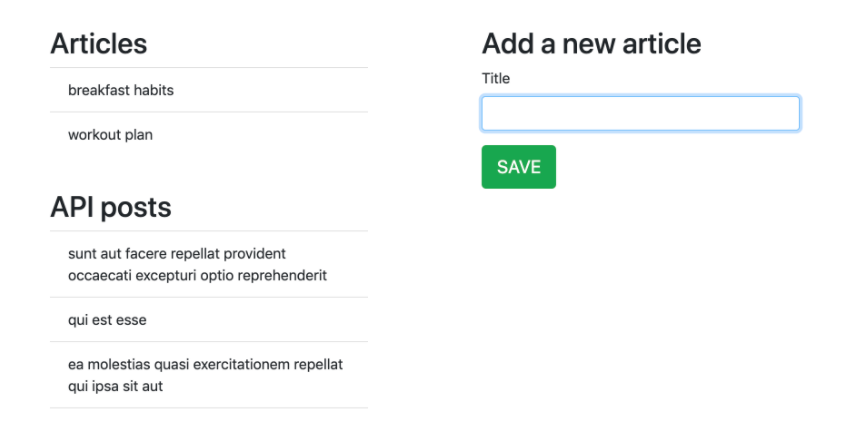

# article-redux-app-starter-code
Starter code for react-redux app

# Instructions

### to run app: 
- `npm install`
- `npm start`

- Use http://jsonplaceholder.typicode.com/posts for Posts API.

- Create Two Posts:
    - Posts from External API (`Posts.jsx`)
    - Posts from User Input (`Form.jsx and List.jsx`)

- For external API Posts, use your knoweldege in **async code in redux**, **redux-thunk**, **middlewares**

- For User Input Posts, use your knoweldege in accepting user input from form and store them inside redux store.

---

### Homepage Should look like this
---

